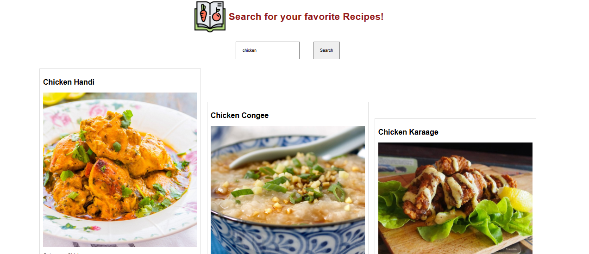

# MyRecipes
A webpage displaying collection of recipes

## Screenshots

## Technologies Used:
- HTML5
- CSS3
- Javascript

## Goals:
- Practice HTML structure and semantic elements
- Implement CSS styling for an attractive layout
- Learn to create responsive designs.

