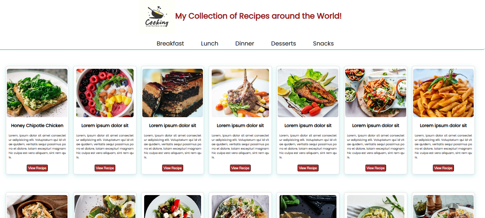

## 🍽️ Recipe Website

This project was originally a static recipe page built with HTML, CSS, and JavaScript (with a basic print feature).

## 🚀 Upcoming Changes
I am currently redeveloping this site to integrate a recipe search feature using an external API. The new version will:

    🔍 Allow users to search for recipes dynamically
    📜 Fetch recipes from an API
    🎨 Improve UI and user experience
    🛠️ Enhance functionality with JavaScript

*More updates will be added soon! Stay tuned.🚀*

## Screenshots (The old Static Website)

## Screenshots of the Dynamic site

## Goals:
- Practice HTML structure and semantic elements
- Implement CSS styling for an attractive layout
- Learn to create responsive designs.
- To learn more about API's

